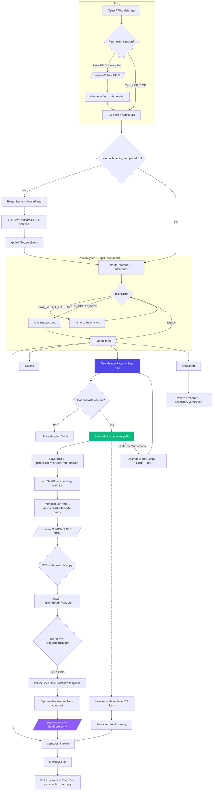

# Haven — end-to-end user journey (code-aligned)

English reference for product and support. Routes and behavior match the current implementation under `src/app-shell/`, `app/app/`, `app/start/`, and `src/features/seal/`.

---

## 1. High-level phases

### Phase 1 — First-time experience (FTUX)

| Step | What happens (code) |
|------|---------------------|
| Open PWA / web app | User lands on **`/app`** (`app/app/page.tsx` → `AppShell` → `AppRouter`). |
| Optional redirect to **`/start`** | If there is **no permanent Supabase session** and **either** onboarding **or** first memory is incomplete—and the user did **not** begin FTUX from `/start`—`app/app/page.tsx` sends them to **`/start`** for Apple/Google OAuth (`FTUX_STARTED_KEY` / `haven.ftux.started.v1`). |
| Home vs timeline | `AppRouter` defaults internal route to **`timeline`**, but on first load if **`haven.onboarding.completed.v1` ≠ `"1"`** it switches to **`home`** (`HomePage`) so the welcome surface shows first. |
| Onboarding | `FirstTimeOnboarding` from `HomePage` / `HelpCenterPage`; completion sets **`haven.onboarding.completed.v1`** and emits telemetry (`onboarding_completed`). |
| Sign-in | Apple or Google via Supabase OAuth (from `HomePage`, `/start`, or quick sign-in flows in `AppRouter`). |
| PWA hint (iOS) | `appFlowMachine`: **`PWA_INSTALL_GATE`** when `platform === "ios"` and the app is not installed, not deferred, and PWA FTUX is not marked done—blocks progression until install/defer or state changes. |
| First ring | After onboarding, **`handleAfterOnboarding`** opens **`RingSetupWizard`** if the user has **not** dismissed setup and **`boundRingCount === 0`**. Independently, **`RING_SETUP_GATE`** auto-opens the wizard when signed in, no bound ring, and `RING_SETUP_DISMISSED_KEY` is not set. |
| Into the app | Wizard `onFinished` navigates to **`timeline`** (Memories) and refreshes memories / ring registry. |

### Phase 2 — Day-to-day

| Surface | Route name in `AppRouter` | Chrome label (`appChromeContent` EN) |
|---------|---------------------------|--------------------------------------|
| Timeline | `timeline` | **Memories** |
| Explore | `explore` | **Explore** |
| Composer | `new` | **Seal new** |
| Rings | `rings` | **Rings** |

**Settings** and **Help** live in the **top bar** of `AppChrome`, not in the bottom tab strip.

Recommended capture path: **Seal new** → `NewMemoryPage`.

### Phase 3 — Create & seal (core loop)

1. User builds a memory on **`NewMemoryPage`** (`route.name === "new"`).
2. Validation requires story/media per existing rules; **Seal with Ring** is the primary ritual when `gateSealWithRingAccess(entitlements)` allows it; otherwise upgrade copy / modal (`havenCopy` + `newMemoryPageContent`).
3. Persisting a draft calls **`primeSealPrepAfterDraftPersisted(draftId)`** (`sealFlowClient.ts`): arms seal session state and records **pending draft IDs** for the SDM payload.
4. User is prompted to touch the ring; the **ring URL** opens **`/start`** with **SDM parameters** (`cmac`, `picc` or `uid`+`ctr`, etc.).
5. **`StartClient`** POSTs **`/api/rings/sdm/resolve`** with **`getSealSdmContextPayload()`** (`context` + `draft_ids` when prep is armed).
6. On **`seal_confirmation`** with a **seal ticket**, **`finalizeSealChainFromSdmResponse`** runs **`finalizeSealWithTicket`** → **`/api/seal/finalize`** (precheck/commit), clears seal prep, then **`window.location.assign("/seal-success")`** (`SEAL_SUCCESS_PATH`).
7. **`/seal-success`** shows **`SealCeremony`**; user returns to **`/app`** via **Return** → back into **`AppRouter`** (typically **Memories**).

**Alternate path — Save securely (Face ID / device lock)**  
Secondary action on `NewMemoryPage` encrypts to the timeline without the ring NFC handoff; user can seal later with a ring when eligible.

### Phase 4 — Management & high-assurance actions

| Area | Notes |
|------|--------|
| **`RingsPage`** | Bind/revoke/rename; copy and flows stress **Face ID / secondary verification** for sensitive operations (`ringsPageContent`). |
| **`MemoryDetailPage`** | Open from Timeline (`route.name === "detail"`). |
| **`SettingsPage`** | Export, subscription, policy links as implemented. |

---

## 2. Mermaid flowchart (implementation sketch)

---

## 3. Quick reference — localStorage / telemetry keys

| Key / constant | Role |
|----------------|------|
| `haven.onboarding.completed.v1` | First-time welcome slides finished |
| `haven.ftux.started.v1` | User began sign-in from `/start` (avoids redirect loop in `app/app/page.tsx`) |
| `haven.ring.setup.dismissed.v1` | User skipped `RingSetupWizard` |
| `haven.first_memory.completed.v1` (`FIRST_MEMORY_DONE_KEY`) | First memory milestone for `/app` gating |
| `PENDING_SEAL_DRAFT_IDS_KEY` / seal flow arm (`lib/seal-flow`) | `/start` payload + finalize |

---

## 4. API touchpoints (seal path)

- **`POST /api/rings/sdm/resolve`** — dynamic NFC / scene (`new_ring_binding`, `daily_access`, `seal_confirmation`).
- **`POST /api/seal/finalize`** — server-side precheck + commit after verified ring ticket.

If product naming changes (e.g. tab labels), update **`src/content/appChromeContent.js`** and keep this doc in sync.
