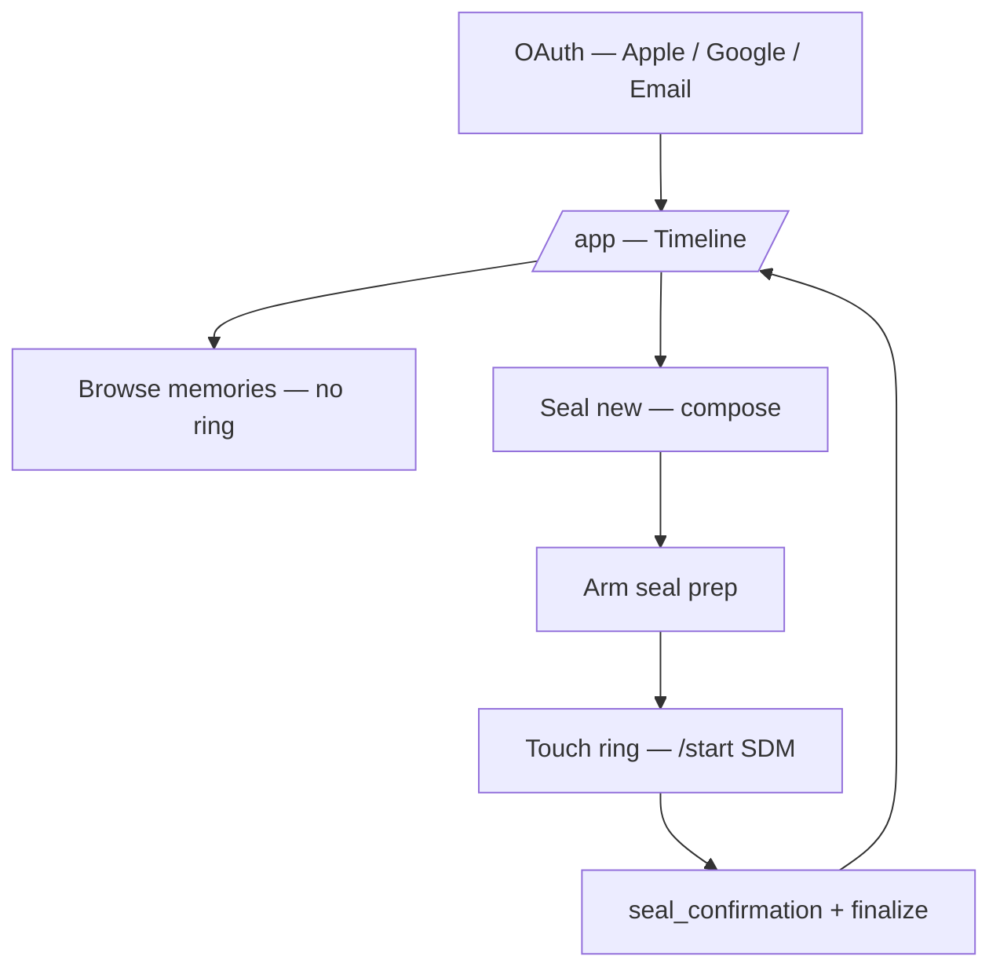
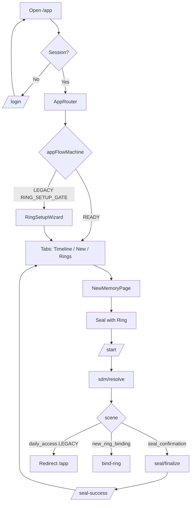

# Haven — end-to-end user journey (code-aligned + target direction)

> **Product SSOT:** `docs/core-definition.md` (2026-06). Where this doc notes **LEGACY**,
> shipping code may still behave that way until Phase 1.

---

## 当前生效产品方向（2026-06 更新）

| Step | Target behavior |
|------|-----------------|
| Sign in | Apple / Google / Email → `/app` |
| Daily read | **Timeline** — no ring required |
| Write | **Seal new** → compose |
| Seal | **Seal with Ring** → tap ring → `/start` → finalize |
| Share | **Shared** (Plus) or export — not full Haven auto-share |
| Ring tap (idle) | **No unlock** — hint to open app and start Seal (Phase 1) |

---

## 1. High-level phases

### Phase 1 — First-time experience

| Step | What happens (code today) | Target |
|------|---------------------------|--------|
| Open app | `/app` → OAuth if needed → `AppShell` | Same |
| Default view | `AppRouter` → **timeline** (or home if onboarding incomplete) | Timeline after minimal onboarding |
| Sign-in | Apple / Google from `/login`, `/app`, `/start` | + **Email** when wired |
| Ring setup | **LEGACY:** `RING_SETUP_GATE` may force `RingSetupWizard` | **Optional** — Settings / Rings |
| Bind ring | Wizard or `/bind-ring` after SDM `new_ring_binding` | Same entry, not blocking app |

### Phase 2 — Day-to-day (target primary)

| Surface | Route | Purpose |
|---------|-------|---------|
| **Memories** | `timeline` | Browse encrypted local memories (OAuth) |
| **Seal new** | `new` | Compose |
| **Rings** | `rings` | Bind / retire / rename |
| **Settings / Help** | top bar | Policies, device trust, explanations |

**No ring tap required** to open Timeline or read memories.

### Phase 3 — Create & seal (core loop)

1. User opens **Seal new** (`NewMemoryPage`).
2. User composes text/media; taps **Seal with Ring** (Plus/trial when gated).
3. Client arms seal prep (`primeSealPrepAfterDraftPersisted`, `lib/seal-flow`).
4. User taps ring → browser opens **`/start`** with SDM params.
5. `StartClient` → `POST /api/rings/sdm/resolve` → **`seal_confirmation`** + ticket.
6. `finalizeSealChainFromSdmResponse` → `POST /api/seal/finalize` → local memory + `/seal-success`.

**Secondary path:** Save securely (no ring) — legacy convenience; may be retired later.

### Phase 4 — Idle ring tap (LEGACY vs target)

| | LEGACY (shipping) | Target (Phase 1) |
|---|-------------------|------------------|
| Scene | `daily_access` | Same API value, **new UX** |
| UX | “Opening Haven…” → redirect `/app` | One line: open app to seal → `/app` |
| Auth | May prompt OAuth on tap if unsigned | OAuth only at `/login` / `/app` gate |

### Phase 5 — Management

| Area | Notes |
|------|--------|
| `RingsPage` | Bind/revoke; device password + secondary token for revoke |
| `SettingsPage` | Cloud backup toggle (framework), export, help links |
| `MemoryDetailPage` | Open from Timeline |

---

## 2. Mermaid — target daily loop

---

## 3. Mermaid — implementation sketch (shipping gates)

---

## 4. Quick reference — keys

| Key | Role |
|-----|------|
| `haven.onboarding.completed.v1` | Welcome slides done |
| `haven.ring.setup.dismissed.v1` | Skipped ring wizard |
| `lib/seal-flow` arm state | Seal prep for `/start` payload |

---

## 5. API touchpoints

| API | Role (target) |
|-----|----------------|
| `POST /api/rings/sdm/resolve` | Verify tap; `new_ring_binding` \| `seal_confirmation` (+ legacy `daily_access`) |
| `POST /api/seal/finalize` | Commit seal |
| `POST /api/nfc/bind` | Bind ring to **current account** |
| `POST /api/auth/nfc-login` | **Disabled (410)** |

---

## Deprecated journey elements

- Tap ring to **enter** app or vault daily.
- Partner **shared Haven** as default couple flow (invite → see all memories).
- `/start` as primary login surface for unsigned users (except bind-before-seal edge cases).
